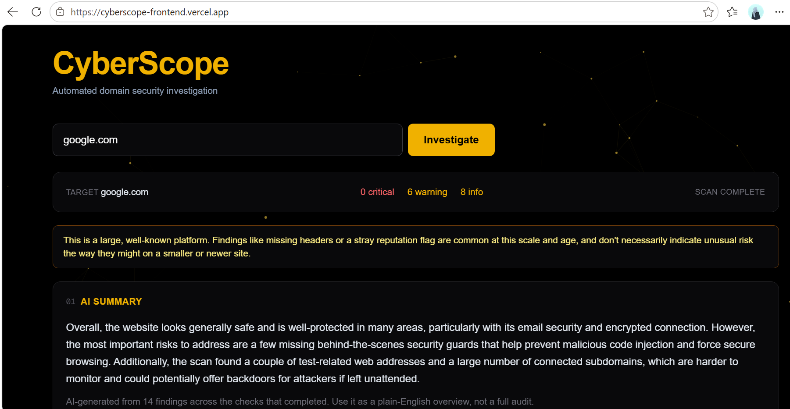

# CyberScope — Frontend

The web interface for [CyberScope](https://github.com/AmnaIdrees-09/CyberScope), an automated domain/IP/URL security investigation tool. Type in a target, and eleven checks run and populate as they complete.

**Live demo:** https://cyberscope-frontend.vercel.app
**Backend repo:** https://github.com/AmnaIdrees-09/CyberScope



## What it does

- Accepts a domain, an IPv4 address, or a full URL, and detects which one it is
- Runs all relevant backend checks in parallel, so slow checks (subdomains, AI summary) don't block fast ones
- Shows each result as its own card, with color-coded severity findings (critical / warning / info)
- Downloads a full PDF report of the scan
- A black-and-gold theme with a cursor-reactive particle background

## Tech stack

- **Next.js 16** (App Router) + **TypeScript**
- **Tailwind CSS**
- No external UI/animation libraries — the particle background is plain Canvas + `requestAnimationFrame`

## Running it locally

**Requirements:** Node.js 18+, and the [CyberScope backend](https://github.com/AmnaIdrees-09/CyberScope) running locally or deployed.

```bash
git clone https://github.com/AmnaIdrees-09/cyberscope-frontend.git
cd cyberscope-frontend
npm install
```

By default this points at `http://127.0.0.1:8000/api` for the backend. To point it elsewhere, create `.env.local`:
NEXT_PUBLIC_API_BASE=http://127.0.0.1:8000/api

(To use the live backend instead of running one locally, set this to `https://cyberscope-production.up.railway.app/api`.)

```bash
npm run dev
```

Open `http://localhost:3000`. Make sure the backend is running (locally or deployed) or the scan requests will fail.

## Project structure
app/
├── page.tsx # Main page — input handling and scan orchestration
├── components/
│ ├── ResultCard.tsx # Shared card shell (loading/error/done states)
│ ├── CardBodies.tsx # Per-check result rendering
│ └── CursorBackground.tsx # Canvas particle background
└── lib/
├── api.ts # Fetch helpers, input parsing/validation
├── types.ts # Shared TypeScript types for every API response
├── theme.ts # All Tailwind classes in one file, for easy re-theming
└── useCard.ts # Hook managing one card's async state

## Deployment

Deployed on [Vercel](https://vercel.com). The `NEXT_PUBLIC_API_BASE` environment variable is set in Vercel's project settings to point at the deployed backend on Railway.

## License

MIT